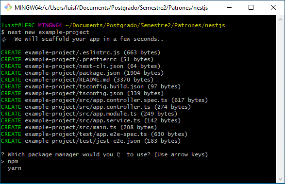
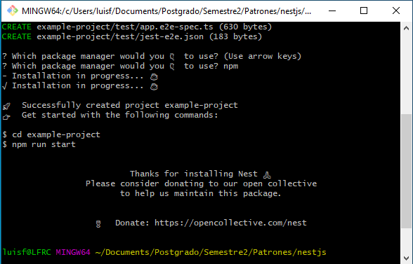

# NestJS-Instalacion

<p align="left">
  <a href="http://nestjs.com/" target="blank"></a>
</p>

1. Ir a la pagina https://nodejs.org/en/download/ y descargar la version LTS de Node.


2. Descargar e instalar git de la pagina https://git-scm.com/download/ Nota: Dar siguiente en cada pantalla de instalación.

3. Crear carpeta en donde desea crear el proyecto.

4. Abrir terminal de **Git Bash**, navegar a la carpeta del proyecto y ejecutar.
```bash
npm i -g @nestjs/cli
```
```bash
nest new example_project
```



5. Oprimir **Enter**




6. Entrar al proyecto
```
cd example_project
```
7. Ejecutar comando.
```
npm run start
```
8. Entrar a la dirección http://localhost:3000 en el navegador.

Para parar el servidor teclear ``CTRL + c``

### Opcional
Para agregar un nuevo entpoint, en el archivo app.controller.ts colocar:

```typescript
  @Get('helloworld')
  getHelloWorld(): string {
    const message = this.appService.getHello();
    return message;
  }
```
Parar el servidor con ``CTRL + c`` y volver a ejecutar el comando ``npm run start``

Entrar a la dirección http://localhost:3000/helloworld

### Referencias
https://nestjs.com/
